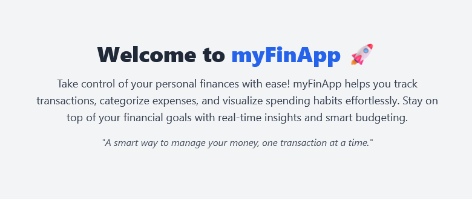
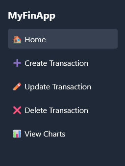
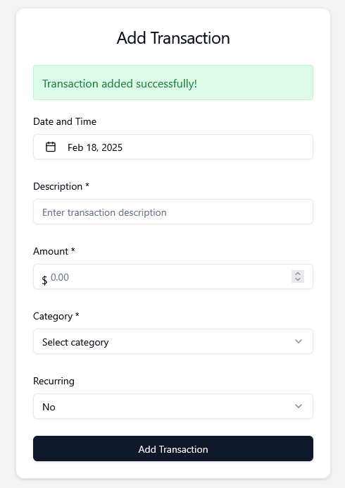
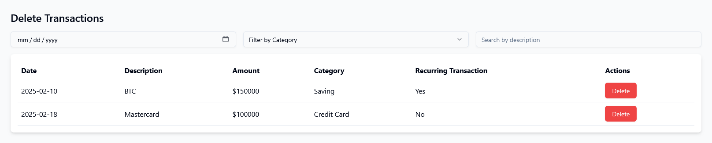
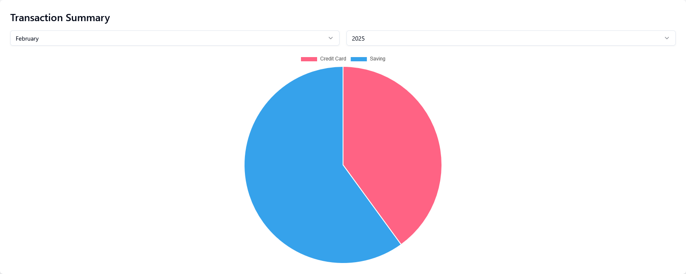
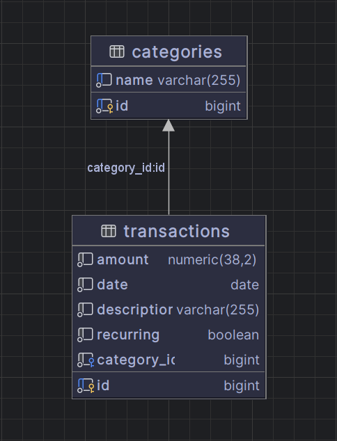

# 📌 MyFinApp – Personal Financial Tracker

🚀 A **minimalist financial tracking web app** built with **Java Spring Boot (Backend), React (Frontend), and PostgreSQL (Database)**, all running in **Docker** for easy deployment.

---

## **📸 Screenshots**
<div align="center">
  
  
  
  
  
  
  
</div>

---

## **📜 Features**
✅ Track your transactions with categories and recurring status  
✅ Simple and clean UI  
✅ Graphs generated with Chart.Js  
✅ Edit transactions with a **date picker**, **toggle for recurrence**, and **manual amount input**  
✅ Powered by **Spring Boot + PostgreSQL + React**  
✅ **Dockerized setup** – Just run `docker-compose up`!

---

## **📂 Tech Stack**
- **Backend:** Java Spring Boot
- **Frontend:** React (Vite) + JavaScript + Chart.Js
- **Database:** PostgreSQL 15
- **Containerization:** Docker & Docker Compose

---

## **📦 Installation & Setup**

### **🔹 Prerequisites**
Make sure you have:  
✅ [Docker & Docker Compose](https://docs.docker.com/get-docker/) installed  
✅ [Git](https://git-scm.com/) installed

---

### **🔹 Clone the Repository**
```bash
git clone https://github.com/matiasalek/myFinApp.git
cd myfinapp
```

---

### **🔹 Setup Environment Variables**
Create a `.env` file in the root directory:
```bash
cp .env.example .env
```

Edit the `.env` file and configure your credentials:
```ini
POSTGRES_DB=myFinAppDb
POSTGRES_USER=postgres
POSTGRES_PASSWORD=your_password
SPRING_DATASOURCE_URL=jdbc:postgresql://postgres:5432/myFinAppDb
SPRING_DATASOURCE_USERNAME=postgres
SPRING_DATASOURCE_PASSWORD=your_password
```

> **Note:** Do not commit `.env` to Git! It contains sensitive credentials.

---

### **🔹 Run the Application with Docker Compose**
Simply run:
```bash
docker-compose up --build
```

This will:  
✅ Start **PostgreSQL** on port `5432`  
✅ Start **Spring Boot Backend** on port `8080`  
✅ Start **React Frontend** on port `5173`

---

### **🔹 Access the Application**
🌍 **Frontend (React App):** [`http://localhost:5173`](http://localhost:5173)  
⚙️ **Backend API (Spring Boot):** [`http://localhost:8080`](http://localhost:8080)  
🛢 **PostgreSQL Database:** `postgres://localhost:5432/myFinAppDb`

---

## **📁 Project Structure**
```
myfinapp/
│── /                     # Java Spring Boot Backend
│── frontend/             # React Frontend
│── database/             # SQL Scripts for Initialization
│── .env.example          # Environment Variables Example
│── docker-compose.yml    # Docker Compose Configuration
│── README.md             # Project Documentation
```

---

## **🔧 Troubleshooting**

### **Docker Container Won’t Start?**
Try removing old containers and volumes:
```bash
docker-compose down -v
docker-compose up --build
```

### **Database Connection Issues?**
Make sure PostgreSQL is running:
```bash
docker ps
```
If the database container isn’t running, restart it:
```bash
docker-compose up -d postgres
```

### **Need to Reset Everything?**
If you want a clean start, remove all containers and volumes:
```bash
docker-compose down -v
rm -rf pgdata
docker-compose up --build
```

---

## **📜 License**
This project is **open-source** and available under the **MIT License**.


---

🔥 **Enjoy tracking your finances effortlessly!** 🚀